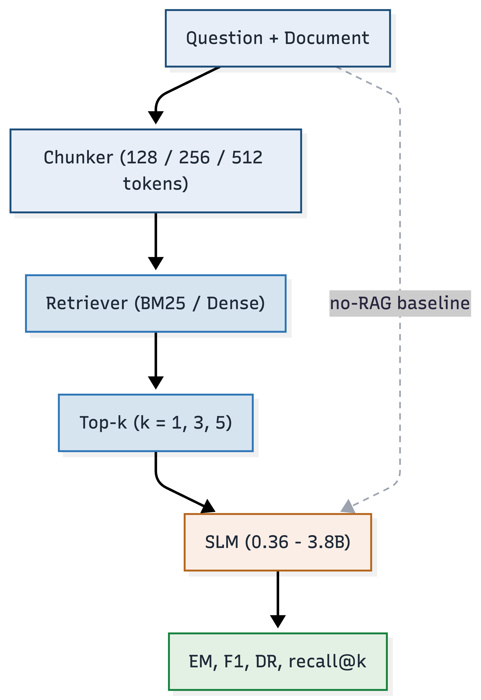
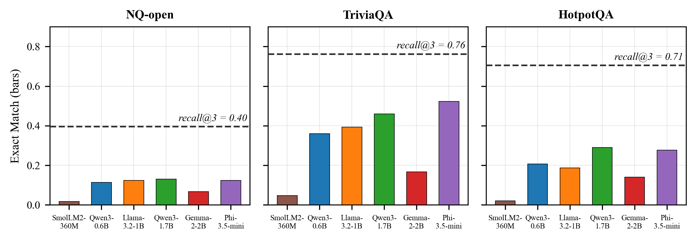
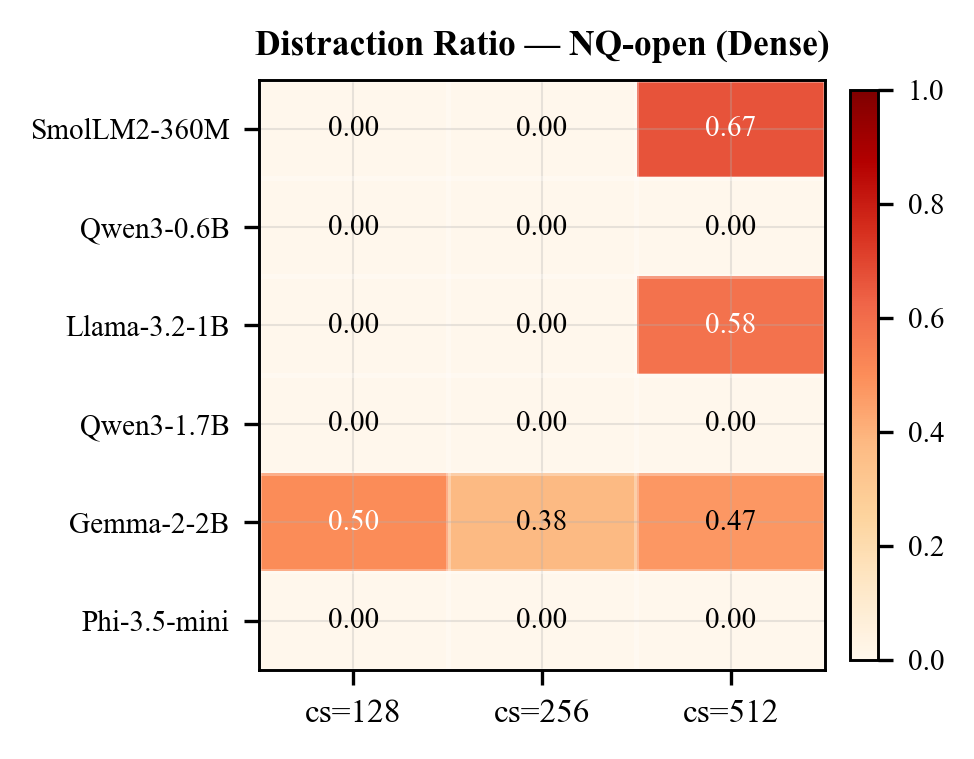
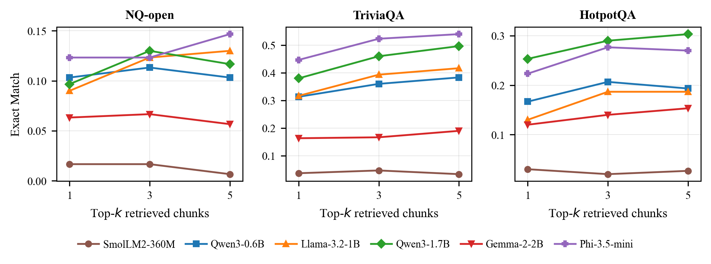

<!-- ============================ HEADER ============================ -->
<div align="center">


<a href="https://git.io/typing-svg"></a>

<br/>


-1F4E79)


</div>

---

## 🎯 The one-sentence version

> Retrieval-Augmented Generation is supposed to make models *more* factual — but for **small** language models, the retriever often surfaces the right passage and the model **still gets it wrong**. We measure exactly when, why, and by how much.

On HotpotQA the retriever puts the gold answer in front of the model **70.7%** of the time. The models answer correctly only **18.7%** of the time. That **~52-point gap** isn't a retrieval problem — it's a *utilisation* problem. This repo contains everything behind that finding.

---

## ✨ Highlights

| | |
|---|---|
| 🧪 **Full-factorial audit** | 6 SLMs × 3 datasets × 3 chunk sizes × 2 retrievers × top-*k* — **~54,000** inference calls |
| 📉 **A new metric — the Distraction Ratio** | the fraction of a model's *correct* closed-book answers that RAG *destroys* |
| 🔍 **Retrieval vs. utilisation, separated** | `recall@k` isolates "never fetched" from "fetched but unused" |
| 🧠 **Architecture beats scale** | Qwen3 *thinking* variants resist distraction; a 2B model gets distracted where a 0.6B one doesn't |
| 📊 **Reproducible** | every CSV, figure, and config in the repo; one command per stage |

---

## 🔬 The pipeline

<div align="center">

</div>

Every question is run **with** retrieval (swept across chunk size, retriever, and top-*k*) and **without** it (closed-book). The no-RAG run is the baseline that every RAG result — and the Distraction Ratio — is measured against.

---

## 📐 The Distraction Ratio (DR)

<div align="center">

**DR = max( 0, (EM<sub>base</sub> − EM<sub>rag</sub>) / EM<sub>base</sub> )**

</div>

`DR = 0` → retrieval did no harm &nbsp;·&nbsp; `DR = 1` → retrieval destroyed *every* previously-correct answer.

Paired with `recall@k`, DR tells two different stories apart:

- **high recall, low EM** → 🧠 *distraction* — the answer was right there, unused
- **low recall** → 🔎 *retrieval failure* — the answer never arrived

---

## 📊 Headline results

<table>
<tr>
<td width="50%" valign="top">

**The utilisation gap** — the retriever's ceiling (dashed) vs. what models actually score.



</td>
<td width="50%" valign="top">

**Where RAG hurts** — distraction is *localised*, not universal.



</td>
</tr>
</table>

<div align="center">

<br/><em>Top-<em>k</em> ablation: TriviaQA rewards more chunks, HotpotQA peaks at k=3, NQ-open saturates early.</em>
</div>

<br/>

<div align="center">

| Finding | Number |
|:--|:--:|
| RAG configs that **significantly help** (Wilson 95% CI) | **56.5%** |
| RAG configs that **significantly hurt** | **1.9%** |
| Utilisation gap on HotpotQA (recall@3 − mean EM) | **52.0 pts** |
| Largest single gap (SmolLM2-360M, TriviaQA) | **71.6 pts** |
| Distraction Ratio of Qwen3 & Phi-3.5 (all configs) | **≈ 0** |

</div>

---

## 🗂️ Repository structure

```
.
├── config.py              # models, datasets, paths, device, token loading
├── data_prep.py           # dataset download + per-question corpus build
├── chunker.py             # token-level fixed-size chunking (tiktoken cl100k_base)
├── retriever.py           # BM25 (sparse) + dense (all-MiniLM-L6-v2) retrievers
├── model_runner.py        # SLM loading + generation (Qwen3 thinking suppression)
├── metrics.py             # Exact Match, token-F1, Distraction Ratio
├── experiment.py          # main 126-configuration grid
├── k_ablation_local.py    # top-k ablation (resume/checkpoint)
├── retrieval_quality.py   # recall@k (no LLM, CPU-only)
├── significance.py        # Wilson 95% CI significance tests
├── visualize*.py          # figures & heatmaps
├── *.ipynb                # Colab notebooks (gated-model + Phi-3.5 runs)
├── data/                  # per-question evaluation corpora (JSON)
└── results/               # output CSVs + figures
```

<details>
<summary><b>📁 Key result files (click to expand)</b></summary>

| File | Contents |
|------|----------|
| `results/results.csv` | EM, F1, DR for all 126 main configurations |
| `results/k_ablation.csv` | top-*k* sweep (k ∈ {1,3,5}) |
| `results/retrieval_quality.csv` | recall@{1,3,5} for all retriever configs |
| `results/retrieval_vs_em.csv` | recall@3 vs. model EM — the utilisation gap |
| `results/significance_rag_vs_baseline.csv` | Wilson 95% CI, RAG vs. baseline |

</details>

---

## 🚀 Quickstart

```bash
# 1. Environment
python -m venv .venv && source .venv/bin/activate
pip install -r requirements.txt

# 2. Token for gated models (Gemma-2, Llama-3.2)
cp .env.example .env        # then paste your HuggingFace token

# 3. Run the audit
python data_prep.py            # build per-question corpora
python experiment.py           # main 126-config grid
python k_ablation_local.py     # top-k ablation
python retrieval_quality.py    # recall@k
python significance.py         # Wilson CI tests
python visualize.py            # figures & heatmaps
```

> 🍏 Runs on Apple Silicon (MPS) and single-GPU (Colab T4). Dense retrieval is CPU-only. Public models need no token.

---

## 📎 Citation

If this work is useful to you, please cite:

```bibtex
@inproceedings{tripathi2026distraction,
  title     = {Found but Not Used: A Full-Factorial Audit of RAG Distraction
               in Small Language Models},
  author    = {Tripathi, Swarnapravo and Kundu, Souvik and
               Sur, Sayanjib and Singh, Pawan Kumar},
  booktitle = {IEEE SILCON},
  year      = {2026}
}
```

---

## 👥 Authors

**Swarnapravo Tripathi**, **Souvik Kundu** — *Heritage Institute of Technology, Kolkata*
**Sayanjib Sur**, **Pawan Kumar Singh** — *Jadavpur University, Kolkata*

<div align="center">

</div>
